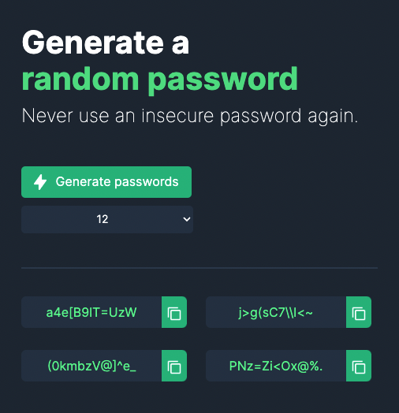

# Random Password Generator

A solo project from the [Scrimba Frontend Developer Career Path](https://scrimba.com/learn/frontend)

## Table of Contents

- [Overview](#overview)
  - [Requirements](#requirements)
  - [Screenshots](#screenshots)
  - [Links](#links)
  - [Built with](#built-with)
- [Future Goals](#future-goals)

  ## Overview

  ### Requirements

- [x] Array to hold all possible chars
- [x] Button to generate 4 random password options
- [x] Display password options
- [x] Stretch: ability to set the password length
- [x] Stretch: 1-click copy password to the clipboard

### Screenshots

### Links

- Live Site URL: [GitHub Pages](https://xchristinawu.github.io/random-password-generator/)

### Built with

- HTML, CSS, JavaScript

## Future Goals
- Add a 'Clear Password' button
- Implement mobile responsive web design

